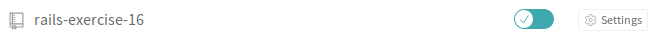
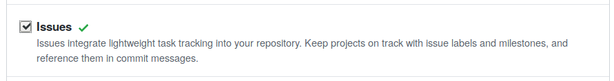

# SWT2 2018/19 - Introductory Exercise

This is an interactive [Ruby on Rails 5](https://rubyonrails.org/) exercise, based partly on the ["Getting Started with Rails"](https://guides.rubyonrails.org/getting_started.html) guide. Interactivity is provided by opening issues in the GitHub issue tracker (through a CI server) that contain instructions on what tasks to tackle next.

We prepared an application stub of an academic paper management system for you that has a failing test case.

Follow these steps to complete the software and the exercise:
## 1) Set up your repository

* Log-in to [Travis CI](http://travis-ci.org) and enable automatic builds for your exercise repository (add the hpi-swt2-exercise group to the list on the left and flip the switch)


* Ensure that the issue tracker of the repository is active. This can be done in the repository's "Settings" tab.


## 2) Set up local development environment

* Clone the repository to your local machine

### Option 1: Local setup
* Change into the newly created directoy
* Inside the directory, check the used Ruby version using `ruby --version`. It should be `2.5.0`. Other Ruby versions might work, but this is the one that was tested.
* If the correct Ruby version is not used, install a ruby version manager, for example [rbenv](https://github.com/rbenv/rbenv) using the instructions for [rbenv installation](https://github.com/rbenv/rbenv#basic-github-checkout) and [ruby-build installation](https://github.com/rbenv/ruby-build#installing-as-an-rbenv-plugin-recommended).
  * WARNING: If you already have the Ruby version manager [RVM](https://rvm.io/) installed, please use that or uninstall it prior to rbenv installation, as the two version managers are incompatible.
* Install Ruby version 2.5.0  with `rbenv install 2.5.0` (this might take a few minutes, as Ruby is being compiled)
* The `.ruby_version` file in the repository instructs the ruby version manager to use the correct version.

### Option 2: Use a Virtual Machine
* Install [Virtualbox](https://www.virtualbox.org/manual/ch02.html) (the VM provider) and [Vagrant](https://www.vagrantup.com/docs/installation/) (to manage VMs) for your platform.
* Run these commands in the root directory of your cloned repository to download and the prepare the VM image:

```
vagrant up # download the image and start the VM
vagrant ssh # connect via ssh
cd hpi-swt2
mkdir -p "$(rbenv root)"/plugins && git clone https://github.com/rbenv/ruby-build.git "$(rbenv root)"/plugins/ruby-build
rbenv install 2.5.0 #install current ruby
ruby --version # check that 2.5.0 is being used
bundle install # install dependencies
exit # restarting the session for changes to take effect
```
* To start the development server:

```
vagrant ssh #connect with VM
cd hpi-swt2
rails s -b 0 #starting rails server, the -b part is necessary since the app is running in a VM and would otherwise drop the requests coming from the host OS
```

* By default, the application is served on port 3000: http://localhost:3000/
* Edits to files in the local folder will be mirrored into the VM's `hpi-swt2` folder as the folders are synced.
* We recommend you open one terminal session that runs the development server and another one to execute commands on the machine (e.g. running tests) or use of a terminal multiplexer. Then you do not have to restart the server after each command.

## 3) Dive into the code

* Run `bundle install` to install the dependencies of the project (they are stored in the `Gemfile`)
* Run `rails db:migrate RAILS_ENV=development && rails db:migrate RAILS_ENV=test` to migrate the database
* Run `rspec` to run the tests ([RSpec](http://rspec.info/) is a test framework for Ruby)
* Try to get the failing test green.

## 4) Commit and push

* When you are done and the test passes, push your changes.
* Travis CI will now try to build and test your project.

## 5) Check your inbox / issues

* You will be notified of problems or new exercise work items via GitHub issues on your repository.
* While you wait, see if your code can use some refactorings, continue reading the tutorial, or plan the next steps.

## 6) For each issue

* Write a new test that documents the missing or failing behavior.
* Commit the failing test and reference the issue.
  * The commit message could be `Failing test for #<ISSUE NUMBER>`.
  * There is no need to push the failing commit.
* Fix the issue and make your test pass. Then commit the changes.
  * While an issue is open, the exercise will create comments on the issue, notifying you of errors

## 7) Repeat steps 4 to 6 until the exercise is complete.

Tips:

* The beginning of this exercise is designed to be solved while reading the official [Rails tutorial](https://guides.rubyonrails.org/getting_started.html)
* Run `rspec spec/<path_to_spec>.rb` to only run one set of specs
* Have a look at `/spec/factories` to get inspiration for your data model
* Besides [generators](https://guides.rubyonrails.org/command_line.html#rails-generate) and scaffolds, [associations](http://guides.rubyonrails.org/association_basics.html) and [validations](http://guides.rubyonrails.org/active_record_validations.html) are needed
* Occasionally start up the server (`rails s`) and have a look at the app in your browser
* Look at the Mockup: https://gomockingbird.com/mockingbird/index.html?project=v890g6l#v890g6l/OQMURm (author selection uses a multiple select in this version of the exercise)
* `rails db:drop && rails db:migrate` deletes the database and recreates it. This might be helpful for error recovery.
* Make sure that all local changes are committed (`git status`) and pushed to the upstream repository (i.e., the one on GitHub) before the deadline

